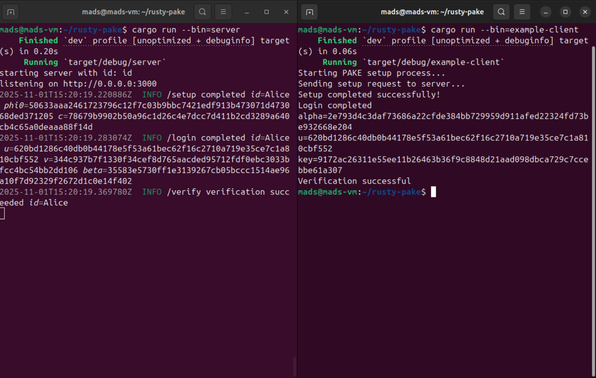

# rusty-pake

**Course**: [02232 Applied Cryptography](https://kurser.dtu.dk/course/02232)

Rust toy implementation of the SPAKE2+ protocol using [`curve25519-dalek`](https://crates.io/crates/curve25519-dalek) as the prime order finite abelian group.

# setup
The following setup steps have been tested on a Ubunto 24.04.3 LTS (slightly newer than the mentioned version).

1. Install fresh Ubuntu VM
2. Update packages and install project dependencies:
```shell
sudo apt update && sudo apt upgrade -y
sudo apt install git curl build-essential libssl-dev pkg-config -y
```
3. Install `rust` as per the [installation instructions](https://rust-lang.org/learn/get-started/):
```shell
curl --proto '=https' --tlsv1.2 -sSf https://sh.rustup.rs | sh
```
The shell needs to be restarted to make `cargo` available.
4. Clone the project:
```shell
git clone https://github.com/wr4ng/rusty-pake.git
cd rusty-pake
```
5. Run automated tests:
```shell
cargo test
```
This runs the internal unit tests but also end-to-end tests where the server is spun up for each of the tests.

To run the server and client manually, use the following commands (in separate terminals)
```shell
cargo run --bin=server
cargo run --bin=client
```


The server id can be controlled using the `SERVER_ID` environment variable:
```shell
SERVER_ID=some-other-id cargo run --bin=server
````

A non-interactive example client can be run against the local server using:
```shell
cargo run --bin=example-client
```
This runs an example flow where a client performs setup, exchange and verification against the server.


This runs multiple clients with multiple rounds of exchange to test the server in a harder scenario:
```shell
cargo run --bin=example-many-clients
```
